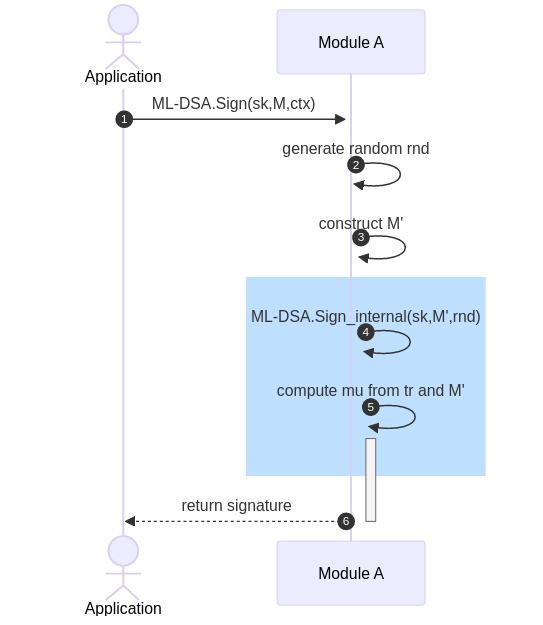
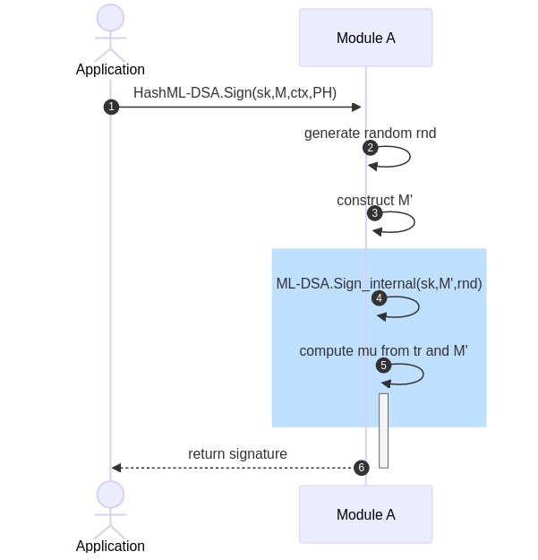
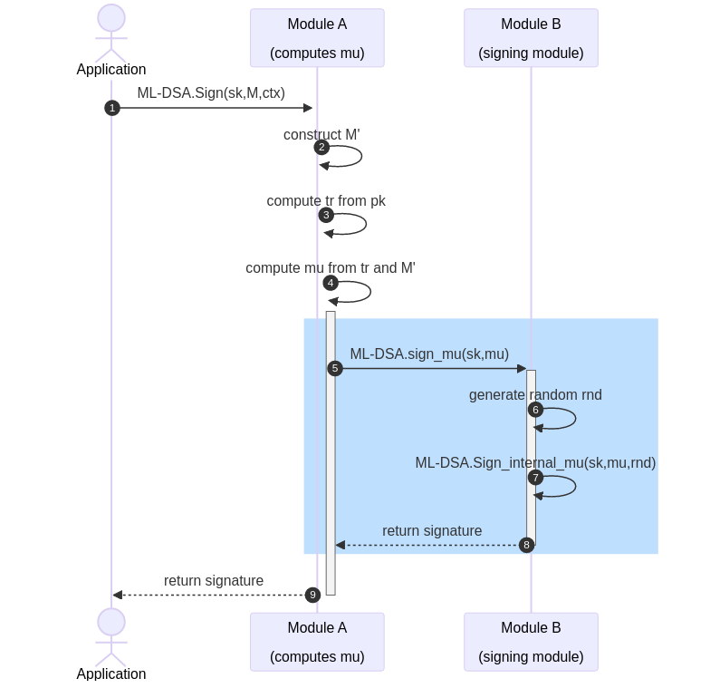
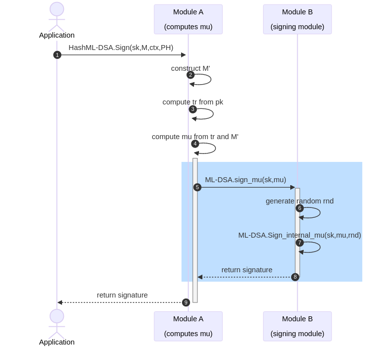
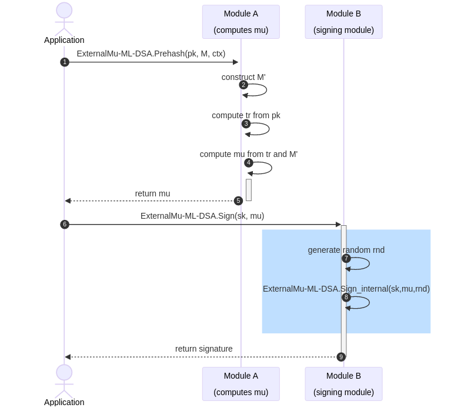
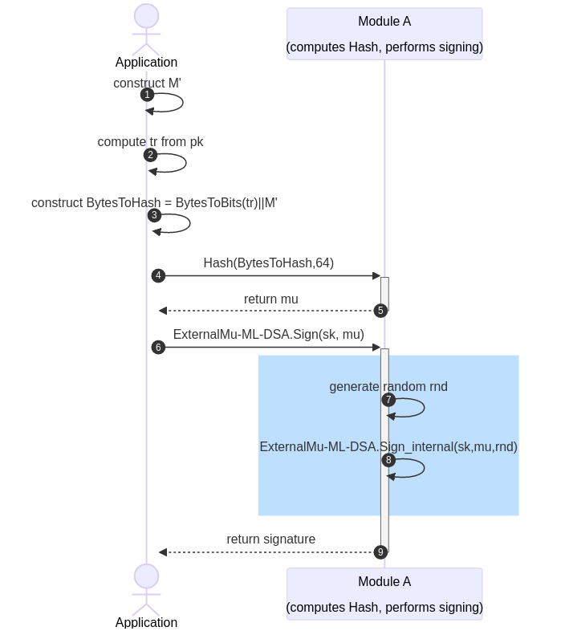

# Background

Diagrams to support discussion about the differences between the NIST and IETF viewpoints on ML-DSA and <i>external Mu</i>.

Note with the publication 
of [FAQ2](https://csrc.nist.gov/csrc/media/Projects/post-quantum-cryptography/documents/faq/fips204-sec6-03192025.pdf), 
NIST is allowing **all** of the externalMu approaches that are noted here.

# FIPS 204 ML-DSA

Standard ML-DSA high level flow. No externalMu.

# FIPS 204 HashML-DSA

Standard HashML-DSA high level flow. No externalMu.

# FIPS 204 NISTFAQ ML-DSA

Standard ML-DSA high level flow with
externalMu using flow documented in 
[NIST FAQ](https://csrc.nist.gov/Projects/post-quantum-cryptography/faqs#Rdc7)

# FIPS 204 NISTFAQ HashML-DSA

Standard HashML-DSA high level flow with
externalMu using flow documented in 
[NIST FAQ](https://csrc.nist.gov/Projects/post-quantum-cryptography/faqs#Rdc7)

# FIPS 204 IETF ExternalMu ML-DSA

IETF variant of ML-DSA using externalMu using flow documented in
[draft-ietf-lamps-dilithium-certificates-07](https://datatracker.ietf.org/doc/draft-ietf-lamps-dilithium-certificates/)

# FIPS 204 IETF ExternalMu ML-DSA In Reality

IETF variant of ML-DSA using externalMu using what 
the IETF participants expect to see. There is no special
module interface for externalMu calculation - it is just a
standard Hash usage. There are not two modules - only one.

